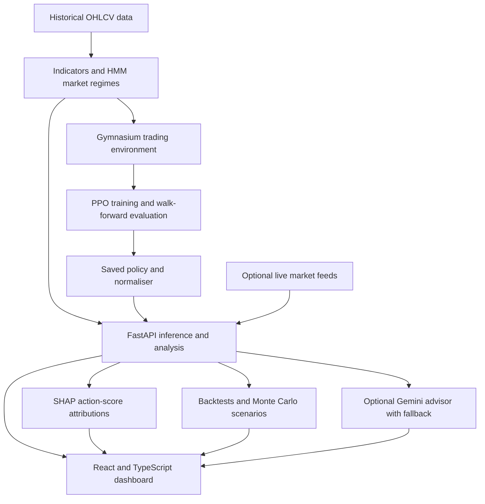

# Architecture

[Back to the project overview](../README.md)

## System flow

This is an analysis application. There is no broker execution component. Training is a separate workflow; launching the dashboard loads the bundled checkpoint.

## Policy and environment

[`ActiveCryptoEnv`](../src/rl_env.py) uses three target-position actions:

| Action | Target position |
| --- | --- |
| `0` | Cash / flat |
| `1` | Long |
| `2` | Short |

The environment handles transitions between positions, fees, slippage, holding limits and drawdown safeguards. The current reward uses scaled log-wealth changes with risk and behavioural shaping terms. The code retains some historical DSR-related parameters; the active reward should be read from `ActiveCryptoEnv.step`, rather than inferred from those parameter names.

With context and regime inputs enabled, each observation contains 17 features: seven market indicators, five context features, one regime feature and four portfolio-state features. Eight observations are stacked for temporal processing.

[`DeepTransformerExtractor`](../src/rl_env.py) embeds each step into 256 dimensions and uses four Transformer encoder layers with eight attention heads. It combines mean sequence features with the last step. A smaller `TinyTransformerExtractor` is also available. The API inspects checkpoint dimensions when selecting the extractor and observation configuration.

## Analysis components

| Component | Implementation |
| --- | --- |
| Market regimes | Five-state Gaussian HMM and forward-filtered regime inference in [`trading_utils.py`](../src/trading_utils.py). |
| Historical evaluation | Sequential folds in [`walk_forward_eval.py`](../src/walk_forward_eval.py), with HMM fitting on each training partition and a configurable purge gap. |
| Feature attribution | SHAP `KernelExplainer` over policy action scores in [`xai_shap.py`](../src/xai_shap.py), with observation normalisation when supplied. |
| Stress scenarios | Noise added to historical log returns and optional injected price crashes in [`mc_engine.py`](../src/mc_engine.py). |
| Advisor | Optional Gemini generation in [`api.py`](../api.py) and deterministic explanations in [`xai_engine.py`](../src/xai_engine.py). |

Attributions explain model scores relative to an explainer baseline. They are not causal explanations, calibrated probabilities or evidence that a decision will be profitable.

## Interface and API

Vite proxies frontend `/api` requests to `127.0.0.1:8000`. FastAPI provides:

| Method | Route | Responsibility |
| --- | --- | --- |
| GET | `/api/scout` | Dashboard asset data and signals. |
| GET | `/api/backtest` | Historical backtest output. |
| GET | `/api/montecarlo` | Scenario analysis and aggregate risk metrics. |
| GET | `/api/shap` | Feature attributions. |
| GET | `/api/comparison` | Saved baseline comparisons. |
| GET | `/api/walk-forward` | Saved walk-forward results. |
| POST | `/api/chat` | Advisor conversation. |

See the running API's `/docs` page for request schemas and parameters. The dashboard combines saved data, model computations and optional network responses; consult the [evaluation notes](EVALUATION.md) when interpreting them.
