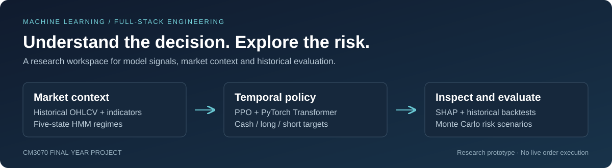

# Adaptive RL Trading Dashboard

**Explore how a reinforcement learning policy responds to changing markets.**

A full-stack research application combining a Transformer-based PPO policy, historical backtesting, market-regime detection, SHAP explanations and Monte Carlo risk analysis.

Built by **Ryan Pong Rui An** for the **CM3070 Computer Science final-year project, University of London**.



[Get started](#get-started) · [Explore the demo](#explore-the-demo) · [Architecture](.github/ARCHITECTURE.md) · [Evaluation](.github/EVALUATION.md) · [Developer guide](.github/DEVELOPMENT.md)

> **Research prototype:** the dashboard analyses signals and simulated trades. It does not connect to a broker or execute real orders. Bundled data and saved results are historical; they are not evidence of future trading performance.

## What it does

The project brings model behaviour, market context and risk into one interface, so a trading signal can be inspected alongside the evidence behind it.

| Area | What you can explore |
| --- | --- |
| **Market dashboard** | Asset charts, model signals and market-regime context for BTC, ETH, DOGE, SPY and QQQ. |
| **Strategy Lab** | Historical backtests, equity curves, returns, drawdowns and trade activity. |
| **Explainability** | SHAP feature attributions for model action scores, alongside an optional Gemini-powered advisor. |
| **Risk simulations** | Monte Carlo price perturbations and sudden-crash scenarios with aggregate downside metrics. |
| **Model School** | Saved walk-forward and baseline results for inspecting model strengths and failure cases. |

## Engineering highlights

- **Custom trading environment:** Gymnasium environment with three target positions (cash, long and short), transaction costs, slippage and configurable drawdown safeguards.
- **Temporal policy:** Stable-Baselines3 PPO with a custom PyTorch Transformer; the deep extractor uses four encoder layers, eight attention heads and eight stacked observations.
- **Market context:** a five-state Gaussian Hidden Markov Model supplements technical indicators and portfolio-state features.
- **Evaluation tooling:** walk-forward training with configurable train/test gaps, training-partition HMM fitting, baseline comparisons and risk metrics.
- **Full-stack delivery:** FastAPI endpoints, a React/TypeScript dashboard, saved checkpoints, sample datasets and automated tests.

Read the [architecture guide](.github/ARCHITECTURE.md) for component responsibilities, action semantics and source-code entry points.

## Get started

### Requirements

- **Python 3.12**
- **Node.js 20.19+ or 22.12+**, with npm
- Git

The local demo includes a saved policy and sample data. **Retraining and a Gemini API key are optional.** The backend selects CUDA when available and otherwise uses the CPU.

### 1. Clone and create the Python environment

```bash
git clone https://github.com/ponggosnayr/cm3070-rl-trading-system.git
cd cm3070-rl-trading-system
python -m venv env
```

Activate the environment for your shell:

| Shell | Command |
| --- | --- |
| Windows PowerShell | `.\env\Scripts\Activate.ps1` |
| Windows Command Prompt | `env\Scripts\activate.bat` |
| macOS / Linux | `source env/bin/activate` |

### 2. Install dependencies

```bash
python -m pip install -r requirements.txt
cd frontend
npm ci
cd ..
```

### 3. Start both servers

In one terminal, from the repository root with the Python environment activated:

```bash
python api.py
```

In a second terminal, from the repository root:

```bash
cd frontend
npm run dev
```

Open **[localhost:5173](http://localhost:5173)**. Interactive API documentation is available at **[localhost:8000/docs](http://localhost:8000/docs)** while the backend is running. Use `Ctrl+C` in each terminal to stop the servers.

On Windows, `Launch_Dashboard.bat` is an alternative after installing the dependencies. Keep its console open while using the app.

For optional Gemini configuration, troubleshooting and test commands, see the [developer guide](.github/DEVELOPMENT.md).

## Explore the demo

1. **Start with the market dashboard.** Select an asset and timeframe; check the displayed data dates and source before interpreting its signal.
2. **Open Strategy Lab.** Inspect the backtest equity curve, drawdown and number of trades together. A flat curve can mean the policy stayed in cash.
3. **Inspect the explanation.** Use SHAP to see which inputs influenced the action scores. The advisor adds a conversational view; it has a deterministic fallback without a Gemini key.
4. **Stress-test the strategy.** Compare normal Monte Carlo perturbations with sudden-crash scenarios.
5. **Visit Model School.** Review saved walk-forward folds and baseline comparisons to understand where the model succeeds or fails.

## Repository guide

| Path | Purpose |
| --- | --- |
| [`api.py`](api.py) | Model loading, inference, HTTP endpoints and advisor integration. |
| [`frontend/src/`](frontend/src/) | React dashboard, charts, recommendation cards and market summaries. |
| [`src/rl_env.py`](src/rl_env.py) | Trading environment and custom Transformer feature extractors. |
| [`src/train_agent.py`](src/train_agent.py) | PPO training and checkpoint management. |
| [`src/walk_forward_eval.py`](src/walk_forward_eval.py) | Sequential out-of-sample evaluation. |
| [`src/trading_utils.py`](src/trading_utils.py) | Indicators, HMM regimes, backtests and trading metrics. |
| [`src/xai_shap.py`](src/xai_shap.py), [`src/xai_engine.py`](src/xai_engine.py) | Feature attributions and explanation logic. |
| [`src/mc_engine.py`](src/mc_engine.py) | Perturbed-price and crash-scenario simulations. |
| [`models/`](models/) / [`data/`](data/) | Saved checkpoints, normalisers, market snapshots and historical results. |
| [`tests/`](tests/) | Environment, numerical, API, data and explanation tests. |

## Reading the results responsibly

The saved experiments show **mixed performance**, including folds with no trades and weak transfer to some markets. Exact historical runs cannot be reproduced from this trimmed repository because the original seeds, input snapshots and complete run manifests were not retained.

Current evaluation code and bundled data also differ from some saved runs. The [evaluation notes](.github/EVALUATION.md) explain these differences, link the original result files and separate software checks from performance evidence.

## Questions and feedback

For a bug report or project question, [open an issue](https://github.com/ponggosnayr/cm3070-rl-trading-system/issues). Include the relevant command, Python/Node versions and error message, with API keys removed.
