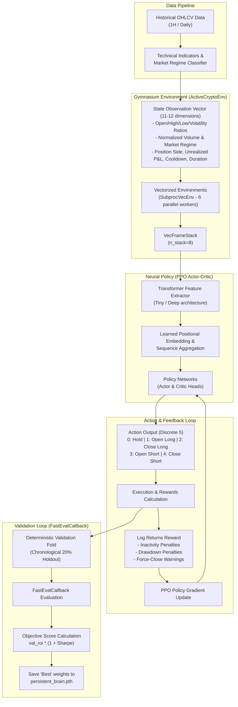

# 🧠 Reinforcement Learning Trading Agent: Training & Optimization Guide

This guide details the complete developer training pipeline, architecture, and optimization strategies for the **Adaptive Multi-Market RL Trading System**. 

The training architecture combines **Proximal Policy Optimization (PPO)** with a high-fidelity **Temporal Transformer Feature Extractor** inside a highly customized, vectorized **Gymnasium Environment** with realistic trading constraints (fees, slippage, and cooldowns).

---

## 🏗️ Reinforcement Learning System Architecture

The following diagram illustrates the complete data flow, neural network processing, and validation feedback loop during the training process:



---

## 🚀 Execution Methods

Model training is managed via a direct script execution method for advanced workflows.

### 🖥️ Primary Method: Command-Line Interface (`src/train_agent.py`)
To train or optimize PPO agents, run the raw Python training script directly. On startup, the script automatically inspects `models/persistent_brain.pth` to discover the neural extractor type (`tiny` vs `deep`) and total pre-trained timesteps to ensure compatibility.

For advanced scripting, batch runs, or headless execution, run the raw training script as follows:

* **Start Fresh Training (Tiny Extractor on CPU):**
  ```bash
  python src/train_agent.py --symbol BTC --interval 1H --steps 128000 --extractor tiny --device cpu --reset
  ```

* **Resume Training on CUDA GPU (overriding checkpoint entropy):**
  ```bash
  python src/train_agent.py --symbol BTC --interval 1H --steps 64000 --extractor deep --device cuda --entropy 0.08 --override-entropy
  ```

---

## ⚙️ Hyperparameters & Training Arguments

The pipeline accepts highly granular parameters to tweak learning performance, market slippage, and behavioral incentives:

### 1. Training Environment & Infrastructure
* `--symbol` (default: `"BTC"`): Targeted ticker. Data must exist in `data/` (e.g. `btc_usdt_1h.csv`).
* `--interval` (choices: `["1H", "Daily"]`): Training resolution. Daily datasets automatically adapt cooldown periods.
* `--steps` (default: `64000`): Total environments interactions. Parallel env steps are aggregated automatically.
* `--device` (choices: `["cpu", "cuda"]`): Target device. GPU acceleration is strongly recommended for `deep` models.

### 2. Neural Extractor Configuration
* `--extractor` (choices: `["tiny", "deep"]`):
  * `tiny`: 1 Transformer Encoder layer, 2 attention heads, `d_model=64`, `dim_feedforward=128`. Ideal for CPU training.
  * `deep`: 4 Transformer Encoder layers, 8 attention heads, `d_model=256`, `dim_feedforward=1024`. Designed for GPU execution.
* `--regime` (choices: `["true", "false"]`): Integrates the **5-Regime Classifier** (+2 Bull High Vol, +1 Bull Low Vol, 0 Sideways, -1 Bear Low Vol, -2 Bear High Vol) into the observation vector, boosting dimensions from 11 to 12.

### 3. Financial Constraints & Environmental Incentives
* `--commission` (default: `0.001` / `0.1%`): Multi-market transaction fee applied to order fills.
* `--slippage` (default: `0.0005` / `0.05%`): Transaction execution variance applied symmetrically.
* `--cooldown` (default: `12` steps): Cooldown period following position liquidation to prevent rapid churning.
* `--inactivity-penalty` (default: `0.005`): Continuous step-wise penalty applied when flat. It is dynamically scaled by candle volatility to prevent trading-averse behavior while maintaining patient capital preservation during stagnant markets.
* `--negative-pnl-penalty` (default: `1.0`): Proportional penalty applied to reward steps when portfolio equity drops below the initial starting balance, deterring continuous drawdowns.

---

## 📉 Validation & The Prevention of Reward Hacking

Reinforcement Learning agents are notoriously adept at "reward hacking"—finding mathematical shortcuts that maximize rewards while failing real-world trading logic (e.g., remaining flat forever to avoid fees, or over-trading to capture microscopic gains).

Our pipeline implements several safeguards via custom callbacks:

### 1. Chronological Holdout (Deterministic Validation Env)
The training pipeline automatically splits historical data. The final **20% of the dataset** is reserved exclusively as a validation set. 
Unlike the training environment which uses randomized starts and episode lengths to boost robustness, the validation environment is **completely deterministic and chronological** to mimic real-world backtest returns.

### 2. FastEvalCallback & The Objective Score
Every `eval_freq` steps, the agent is evaluated against the unseen validation fold. Instead of ranking models based on step-wise RL shaping rewards (which contain artificial inactivity penalties), we rank checkpoints using a true **Objective Score**:

$$\text{Objective Score} = \text{ROI \%} \times (1.0 + \max(0.0, \text{Sharpe Ratio}))$$

This ensures that the model preserved in `persistent_brain.pth` is selected purely based on **risk-adjusted real portfolio returns**, preventing the agent from overfitting to trade-averse shaping penalties.

### 3. Early Stopping (No Model Improvement Callback)
To prevent overfitting to the training distribution and save valuable compute resources, we employ a `StopTrainingOnNoModelImprovement` callback. If the **Objective Score** on the validation fold does not improve for `5` consecutive evaluations (after a minimum of `8` evaluations), training terminates early.

---

## 💾 Model Checkpoint Lifecycle

```text
FINAL PROJECT/
└── models/
    ├── persistent_brain.pth        <-- The absolute BEST model weights (highest Objective Score)
    ├── persistent_brain_final.pth  <-- The final weight state of the model when training finished
    ├── TINYfinal1.pth              <-- Backup checkpoint
    └── TINYprettygood1.pth          <-- Backup checkpoint
```

> [!IMPORTANT]
> **Checkpoints are self-describing.**
> When loading `persistent_brain.pth`, the system automatically inspects the state dictionary keys and shape dimensions (specifically `features_extractor.embedding.weight`). It determines whether it was trained on the `tiny` or `deep` architecture, and whether it included the `regime` feature vector. This auto-configuration guarantees zero-crash continuous learning and deployment.

---

## 💡 Pro-Developer Optimization Guide

Use the following strategies to train models capable of outstanding real-world performance:

### 1. Dynamic Hyperparameter Scaling
The pipeline automatically scales PPO parameters based on your selected architecture complexity and target compute hardware:

| Parameter | Tiny Model (CPU/GPU) | Deep Model (CPU) | Deep Model (GPU) |
| :--- | :--- | :--- | :--- |
| **Base Learning Rate** | $1 \times 10^{-4}$ (Fast) | $1 \times 10^{-5}$ (Slower) | $3 \times 10^{-5}$ (Optimal) |
| **Rollout Steps (`n_steps`)** | $2,048$ (CPU) / $8,192$ (GPU) | $2,048$ | $8,192$ |
| **Batch Size** | $1,024$ (CPU) / $4,096$ (GPU) | $1,024$ | $4,096$ |
| **Optimization Epochs** | $4$ (CPU) / $3$ (GPU) | $4$ | $4$ |

### 2. Managing Exploration & Entropy
* **Entropy Decay Callback:** PPO relies on action probability entropy to explore. The pipeline linearly decays the entropy coefficient (`ent_coef`) from your starting value down to a floor ($0.02$ for Deep, $0.01$ for Tiny) over the course of training.
* **Overcoming Policy Collapse:** If the agent becomes trading-averse (keeps action probabilities stuck on "Hold"), try starting a training run with a reset checkpoint, a high exploration entropy (`--entropy 0.10`), and a minor inactivity penalty boost (`--inactivity-penalty 0.010`).

---

## 📝 Training Verification Checklist

Before starting long training cycles, verify your setup:

- [ ] **Dependencies Active:** Run `env\Scripts\activate` in your shell.
- [ ] **Data Synchronized:** Confirm historical CSVs exist in `data/` with open, high, low, close, and volume columns.
- [ ] **Unit Tests Passing:** Run `Run_Tests.bat` to confirm environment and extraction mathematics are sound.
- [ ] **Device Confirmed:** For `deep` model runs, confirm CUDA is accessible by running `python -c "import torch; print(torch.cuda.is_available())"`.
- [ ] **Weights Saved:** Verify `models/persistent_brain.pth` was updated post-training.
